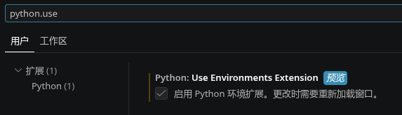
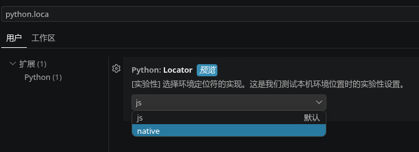
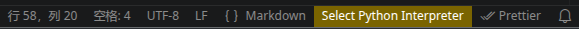

# PET Deploy Tools for LoongArch64

用于在 LoongArch64 (LA64) 平台上部署 [Python Environment Tools (PET)](https://github.com/wubzbz/python-environment-tools-la64) 的安装脚本和本地化资源。

## 问题

如果你使用 **Code-OSS** 或 **VSCodium** 编写 Python，可能会遇到以下现象之一：

### 现象一：启用了 `ms-python.vscode-python-envs` 扩展后功能异常

在设置中开启了 `Python › Use Environments Extension`（见下图）：



或者在设置中将 `Python › Locator` 设置为  `native` （见下图）：



随后出现：

- 状态栏中无法选择 Python 解释器，出现黄色的"Select Python Interpreter"（见下图）



- 创建虚拟环境报错
- 输出面板（Output → Python Environments）中出现以下典型错误：

```
[error] [pet] Process error: 发生了系统错误 (spawn .../python-env-tools/bin/pet ENOENT)
[warning] [pet] Restarting Python Environment Tools (attempt 1/3, waiting 1000ms)
[warning] [pet] Restarting Python Environment Tools (attempt 2/3, waiting 2000ms)
[warning] Configure request timed out (attempt 1/2)
[error] [pet] Error refreshing Request 'configure' timed out after 30000ms
[warning] [pet] Server mode exhausted, falling back to JSON CLI for refresh
[error] [pet] JSON CLI fallback refresh failed: 发生了系统错误 (spawn .../python-env-tools/bin/pet ENOENT)
[warning] [Pipenv] Environment discovery failed after 96.9s.
  Error: spawn_enoent - spawn .../python-env-tools/bin/pet ENOENT
[error] [system] Background initialization failed: [Error: spawn .../python-env-tools/bin/pet ENOENT]
```

如果启用了 `python.locator = native`，Python 扩展的输出面板中会出现：

```
[error] Python Locator process error: spawn .../python-env-tools/bin/pet ENOENT
```


> [!IMPORTANT]
> 如果上述设置开关未开启，Python 扩展即便没有 PET 也能正常工作（解释器发现、虚拟环境创建等）。详见[技术分析报告](https://loongbbs.cn/d/505-vscodium%E6%89%A9%E5%B1%95%E4%B8%A4%E9%9A%BE%E5%9B%B0%E5%A2%83open-vsx%E4%B8%8A%E7%9A%84python%E6%89%A9%E5%B1%95%E5%B7%B2%E6%97%A0%E6%B3%95%E8%B7%A8%E5%B9%B3%E5%8F%B0%E5%B7%A5%E4%BD%9C)了解原因。

### 现象二：部分 UI 文本显示为英文

即使基本功能正常，扩展的菜单、提示等 UI 文本部分为英文，缺少中文翻译。


## 原因

上述问题源于 VSCode 生态中两条不同的扩展分发渠道：

| 渠道 | 编辑器 | 扩展包 | PET 二进制 | i18n 文件 |
|------|--------|--------|:----------:|:---------:|
| VSCode Marketplace | VS Code | 平台特定包 | ✅ 自带 | ✅ 自带 |
| Open VSX | Code-OSS / VSCodium | Universal 包 | ❌ 缺失 | ❌ 通常缺失 |

**Open VSX 目前不支持按 CPU 架构分发的扩展包**（参见 [publish-extensions#1002](https://github.com/EclipseFdn/publish-extensions/issues/1002)），
因此通过它安装的 `ms-python.python` 和 `ms-python.vscode-python-envs` 扩展只能使用不包含平台特定二进制的 Universal 版本。

这一差异已被多名用户报告（参见 [VSCodium#2752](https://github.com/VSCodium/vscodium/issues/2752)）。

其中，`ms-python.vscode-python-envs` 扩展**强依赖 PET 二进制**——没有 PET 则环境发现完全失败。

## 解决方案

运行本仓库提供的 `install-pet.py`，它会自动：

1. 检测当前平台（仅支持 LoongArch64）
2. 扫描已安装的 `ms-python.python` 和 `ms-python.vscode-python-envs` 扩展
3. 从 [PET Release](https://github.com/wubzbz/python-environment-tools-la64/releases) 下载最新的 musl 二进制
4. 从本仓库下载缺失的中文翻译文件
5. 安装到扩展目录，并备份旧版本

纯 Python 3 实现，零外部依赖。

```bash
# 安装或更新 PET（交互式）
python3 scripts/install-pet.py

# 仅检查，不执行任何修改
python3 scripts/install-pet.py --dry-run
```

脚本执行后会依次展示平台检测、扩展扫描、下载校验、安装结果，退出码可用于自动化判断。

## 内容

| 路径 | 说明 |
|------|------|
| `scripts/install-pet.py` | PET 安装/更新脚本（Python 3.6+） |
| `resource/i18n/ms-python.python/` | `ms-python.python` 中文翻译 |
| `resource/i18n/ms-python.vscode-python-envs/` | `ms-python.vscode-python-envs` 中文翻译 |

## 参考

- [技术分析：PET 缺失时的 fallback 行为](https://loongbbs.cn/d/505-vscodium%E6%89%A9%E5%B1%95%E4%B8%A4%E9%9A%BE%E5%9B%B0%E5%A2%83open-vsx%E4%B8%8A%E7%9A%84python%E6%89%A9%E5%B1%95%E5%B7%B2%E6%97%A0%E6%B3%95%E8%B7%A8%E5%B9%B3%E5%8F%B0%E5%B7%A5%E4%BD%9C)
- [PET(la64) 二进制发布](https://github.com/wubzbz/python-environment-tools-la64/releases)
- [Open VSX 不支持平台特定包](https://github.com/EclipseFdn/publish-extensions/issues/1002)
- [VSCodium 用户报告 PET 缺失](https://github.com/VSCodium/vscodium/issues/2752)

## 许可

与原项目一致。参见 PET 仓库的 [LICENSE](https://github.com/wubzbz/python-environment-tools-la64/blob/main/LICENSE) 文件。
